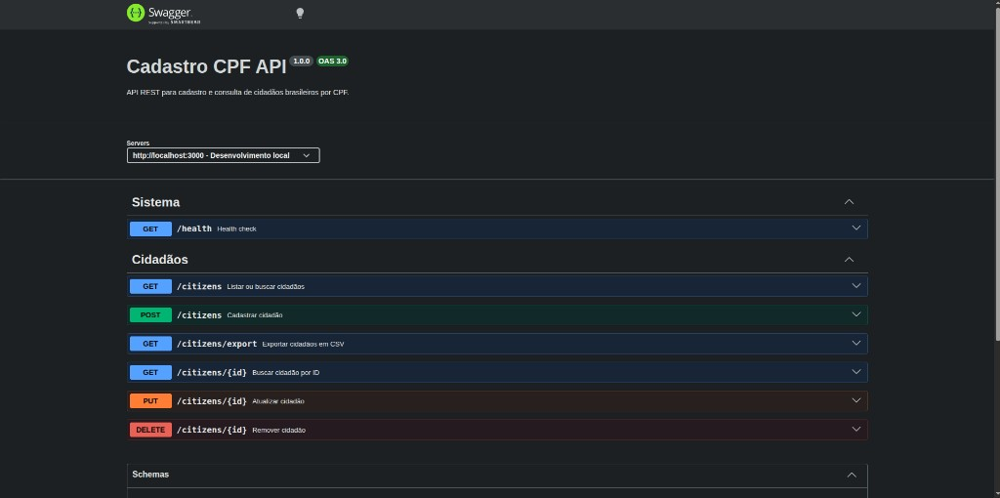
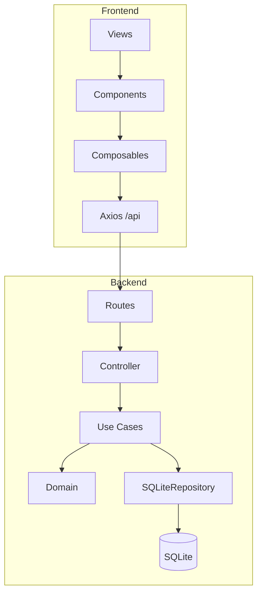

# Cadastro CPF

[](https://github.com/camilagoulartsoares/citizen-registry-system/actions/workflows/ci.yml)

Sistema web de **cadastro e consulta de cidadãos brasileiros por CPF**, com validação de dígitos verificadores, persistência em SQLite, **documentação Swagger/OpenAPI** e interface administrativa inspirada em sistemas municipais (identidade visual GESUAS).

---

## Demo (produção)

| Recurso | URL |
|---------|-----|
| **Aplicação web (Vue)** | https://citizen-registry-system.vercel.app |
| **Swagger UI** | https://citizen-registry-system-backend.onrender.com/api-docs |
| **OpenAPI JSON** | https://citizen-registry-system-backend.onrender.com/api-docs.json |
| **Health check** | https://citizen-registry-system-backend.onrender.com/health |


> A raiz do backend (`/`) redireciona automaticamente para o **Swagger**.  
> No plano free do Render, a primeira requisição após inatividade pode levar ~50s.

### Vercel — app errado ou projeto React antigo?

Se o link da Vercel abre **outra aplicação**, o deploy está apontando para a pasta errada:

1. Vercel → **Project Settings** → **General** → **Root Directory** → deixe **vazio** (usa `vercel.json` na raiz) **ou** selecione `frontend`
2. **Environment Variables** → `VITE_API_URL` = `https://citizen-registry-system-backend.onrender.com`
3. **Redeploy** o projeto

O arquivo `vercel.json` na raiz do repositório já configura build em `frontend/dist`.

---

## Destaques do projeto

| | |
|---|---|
| **Swagger UI** | Documentação interativa da API em `/api-docs` — teste endpoints pelo navegador |
| **Clean Architecture** | Backend em camadas: Domain → Application → Infrastructure → HTTP |
| **79 testes** | 60 Jest + 16 Vitest + 3 Playwright E2E + GitHub Actions CI |
| **CRUD completo** | Cadastrar, listar, buscar, editar, remover cidadãos |
| **Exportação CSV** | `GET /citizens/export` + download na interface |
| **Rate limiting** | Proteção básica para produção (100 req/IP / 15 min) |
| **Validação de formulário** | Nome com letras (mín. 3 caracteres); CPF com dígitos verificadores; verificação de CPF já cadastrado em tempo real |
| **UX moderna** | Dark mode, snackbar global, skeleton loader, página 404 |

### Links rápidos (desenvolvimento local)

| Recurso | URL |
|---------|-----|
| **Swagger UI** | http://localhost:3000/api-docs |
| **OpenAPI JSON** | http://localhost:3000/api-docs.json |
| **Frontend** | http://localhost:5174 |
| **Health check** | http://localhost:3000/health |

---

## Documentação Swagger (OpenAPI 3.0)

A API possui **documentação profissional e interativa** gerada com **swagger-jsdoc** e servida com **swagger-ui-express**. Todos os endpoints podem ser testados direto no navegador com **Try it out**.



| Item | Detalhe |
|------|---------|
| **Título** | Cadastro CPF API v1.0.0 |
| **Especificação** | OpenAPI 3.0 (OAS 3.0) |
| **Servidor** | `http://localhost:3000` |
| **Arquivo fonte** | `backend/src/http/swagger.js` |
| **Tag Sistema** | `GET /health` |
| **Tag Cidadãos** | CRUD + `GET /citizens/export` (CSV) |
| **Schemas** | `Citizen`, `CitizenInput`, `PaginatedCitizens`, `Error` |

```bash
# Subir o backend e abrir o Swagger
cd backend && npm run dev
# Acesse: http://localhost:3000/api-docs
```

---

## Tecnologias

| Camada | Tecnologias |
|--------|-------------|
| **Backend** | Node.js, Express 4, better-sqlite3, CORS, Swagger (OpenAPI), express-rate-limit |
| **Frontend** | Vue 3 (Composition API), Vuetify 3, Vue Router 4, Vite 6, Axios |
| **Testes** | Jest + supertest (backend), Vitest (frontend), **Playwright E2E**, **GitHub Actions CI** |
| **Infraestrutura** | Docker, docker-compose |
| **Dev** | concurrently (sobe back + front juntos) |

## Estrutura do projeto

Arquitetura **monorepo** com backend (Clean Architecture) e frontend (Vue 3):

```
citizen-registry-system/
│
├── docs/
│   └── images/
│       ├── app-demo.jpg            # Print da interface (home)
│       └── swagger-ui.png          # Print da documentação Swagger
│
├── backend/                        # API REST — Node.js + Express
│   ├── src/
│   │   ├── domain/                 # Regras de negócio puras (sem Express/SQLite)
│   │   │   ├── Citizen.js          # Entidade cidadão
│   │   │   ├── CpfValidator.js     # Validação de CPF
│   │   │   ├── NameValidator.js    # Validação de nome (letras + mínimo 3 caracteres)
│   │   │   └── CitizenRepository.js# Contrato do repositório
│   │   │
│   │   ├── application/            # Casos de uso (uma classe por operação)
│   │   │   ├── RegisterCitizen.js
│   │   │   ├── FindCitizen.js
│   │   │   ├── ListCitizens.js
│   │   │   ├── GetCitizen.js
│   │   │   ├── UpdateCitizen.js
│   │   │   ├── DeleteCitizen.js
│   │   │   └── ExportCitizens.js   # Exportação CSV
│   │   │
│   │   ├── infrastructure/         # Persistência e utilitários
│   │   │   ├── SQLiteRepository.js # Implementação SQLite
│   │   │   └── csvExport.js        # Geração do arquivo CSV
│   │   │
│   │   └── http/                   # Camada HTTP
│   │       ├── createApp.js        # Factory Express (CORS, rate limit, Swagger)
│   │       ├── swagger.js          # Especificação OpenAPI 3.0
│   │       ├── routes.js           # Rotas REST
│   │       ├── citizenController.js
│   │       └── middlewares/
│   │           ├── cors.js
│   │           ├── rateLimit.js    # express-rate-limit
│   │           └── errorHandler.js
│   │
│   ├── tests/                      # 60 testes Jest (unitários + integração supertest)
│   │   ├── http/                   # Integração supertest
│   │   ├── helpers/                # App de teste + fixtures
│   │   ├── CpfValidator.test.js
│   │   ├── NameValidator.test.js
│   │   ├── RegisterCitizen.test.js
│   │   ├── UpdateCitizen.test.js
│   │   ├── DeleteCitizen.test.js
│   │   └── SQLiteRepository.test.js
│   │
│   ├── data/                       # SQLite gerado em runtime
│   ├── server.js
│   └── package.json
│
├── frontend/                       # Interface — Vue 3 + Vuetify 3
│   ├── src/
│   │   ├── views/                  # Home, Cadastrar, Consultar, Lista, 404
│   │   ├── components/             # Tabela, modais, formulários, snackbar
│   │   ├── composables/            # useCitizen, useCpfMask, useCpfAvailability, useNameValidation, useSnackbar, useAppTheme
│   │   ├── services/api.js         # Cliente Axios (/api → proxy Vite)
│   │   ├── router/index.js
│   │   ├── test/setup.js           # Setup Vitest + Vuetify
│   │   └── assets/styles/main.css  # Design tokens GESUAS
│   ├── public/favicon.svg
│   └── package.json
│
├── docker-compose.yml
├── package.json                    # npm run dev | test | install:all
└── README.md
```

### Fluxo das camadas (backend)

```
Requisição HTTP
      ↓
createApp.js  →  rateLimit  →  Swagger (/api-docs)  →  routes.js
      ↓
citizenController.js
      ↓
Casos de uso (application/)
      ↓
Domain (validações)  +  SQLiteRepository (infrastructure/)
      ↓
SQLite (data/citizens.sqlite)
```

---

---

## Hospedagem (produção)

**Não precisa de outro projeto** — o mesmo repositório, dois deploys:

| Parte | Plataforma | URL / pasta |
|-------|------------|-------------|
| Frontend | [Vercel](https://citizen-registry-system.vercel.app) | `frontend/` → https://citizen-registry-system.vercel.app |
| Backend | [Render — Swagger](https://citizen-registry-system-backend.onrender.com/api-docs) | `backend/` |
| Swagger | Render | https://citizen-registry-system-backend.onrender.com/api-docs |

Guia completo passo a passo: **[docs/DEPLOY.md](docs/DEPLOY.md)**

---

## Como rodar

### Opção rápida (backend + frontend juntos)

Na raiz do projeto:

```bash
npm install
npm run install:all
npm run dev
```

- Backend: http://localhost:3000
- Frontend: http://localhost:5174
- Health check: `curl http://localhost:3000/health` → `{"status":"ok"}`
- **Swagger UI:** http://localhost:3000/api-docs

### Separado

```bash
# Terminal 1
cd backend && npm install && npm run dev

# Terminal 2
cd frontend && npm install && npm run dev
```

### Com Docker

```bash
docker-compose up
```

Acesse: http://localhost:5174

### Testes automatizados (backend)

```bash
cd backend
npm install
npm test
```

**Com relatório de cobertura:**

```bash
cd backend
npm run test:coverage
```

**Rodar um arquivo ou suite específica:**

```bash
cd backend

# só integração HTTP (supertest)
npm test -- tests/http/citizens.routes.test.js

# só repositório SQLite em memória
npm test -- tests/SQLiteRepository.test.js

# só casos de uso
npm test -- tests/RegisterCitizen.test.js
npm test -- tests/UpdateCitizen.test.js
npm test -- tests/DeleteCitizen.test.js

# filtrar por nome do teste
npm test -- -t "cadastra cidadão"
```

Os testes **não precisam** do servidor rodando nem do banco em disco — usam SQLite `:memory:` e o app Express montado em memória.

### Testes automatizados (frontend — Vitest)

Na raiz (roda backend + frontend):

```bash
npm test
```

Só o frontend:

```bash
cd frontend
npm install
npm test
```

**Modo watch (re-executa ao salvar):**

```bash
cd frontend
npm run test:watch
```

**Arquivos de teste:**

| Arquivo | O que testa |
|---------|-------------|
| `src/composables/useCpfMask.test.js` | `unmask`, `mask`, `isValid` |
| `src/components/CitizenForm.test.js` | Nome curto, nome só com números e botão desabilitado |
| `src/composables/useCitizen.test.js` | Tratamento de CPF duplicado (API mockada) |

### Build de produção (frontend)

```bash
cd frontend && npm run build
```

## Integração Frontend ↔ Backend

O frontend se comunica com o backend via proxy do Vite em desenvolvimento:

- Requisições vão para `/api/*` (ex: `/api/citizens`)
- O Vite redireciona para `http://localhost:3000/*`
- Configuração em `frontend/.env.development`

```
Frontend: GET /api/citizens?page=1&limit=10
    ↓ proxy (vite.config.js)
Backend:  GET http://localhost:3000/citizens?page=1&limit=10
```

### Teste manual

1. Cadastre um cidadão com CPF válido (ex: `529.982.247-25`)
2. Use a busca com o nome ou CPF cadastrado
3. Acesse **Lista de cidadãos** para ver a tabela paginada
4. Clique em **Baixar CSV** na home ou na lista para exportar os dados
5. Abra **http://localhost:3000/api-docs** para explorar e testar a API pelo Swagger

## Funcionalidades implementadas

### Backend

| Funcionalidade | Detalhes |
|----------------|----------|
| **CRUD de cidadãos** | Cadastrar, listar, buscar, editar e remover por ID |
| **Validação de CPF** | Dígitos verificadores + rejeição de sequências repetidas |
| **Listagem paginada** | `page`, `limit` (máx. 100) e `query` no banco (`LIMIT`/`OFFSET`) |
| **Busca simples** | `GET /citizens?query=` retorna até 10 resultados |
| **Exportação CSV** | `GET /citizens/export` — colunas Nome, CPF, Data de cadastro (UTF-8 + BOM) |
| **Swagger / OpenAPI 3.0** | Documentação interativa em `/api-docs` (swagger-jsdoc + swagger-ui-express) |
| **Rate limiting** | 100 req/IP a cada 15 min (express-rate-limit), desligado em testes |
| **Clean Architecture** | Domain → Application → Infrastructure → HTTP |
| **Testes** | 60 testes Jest (unitários, repositório `:memory:`, integração supertest) |

### Frontend

| Funcionalidade | Detalhes |
|----------------|----------|
| **Cadastro e consulta** | Formulários com máscara de CPF, validação em tempo real e verificação de CPF duplicado antes do envio |
| **Lista paginada** | Tabela com busca (debounce 400ms), visualizar, editar e excluir |
| **Modais** | Fluxo de atenção → confirmação → sucesso na exclusão; edição e detalhes |
| **Download CSV** | Atalho na home e botão na lista (respeita filtro de busca) |
| **Dark mode** | Alternância claro/escuro com persistência em `localStorage` |
| **Snackbar global** | Toasts centralizados para sucesso e erro |
| **Skeleton loader** | Placeholder na tabela durante carregamento |
| **Página 404** | Rota catch-all customizada |
| **Transições** | Fade entre rotas |
| **Favicon e título** | Ícone SVG e título dinâmico por página |
| **Testes** | 13 testes Vitest (`useCpfMask`, `CitizenForm`, `useCitizen`) |

## API REST

> Documentação completa e interativa: **http://localhost:3000/api-docs**

### Documentação Swagger (detalhes)

A API é documentada com **OpenAPI 3.0** gerada via **swagger-jsdoc** e servida com **swagger-ui-express**.

| Recurso | URL |
|---------|-----|
| **Swagger UI** (interface interativa) | http://localhost:3000/api-docs |
| **Especificação JSON** | http://localhost:3000/api-docs.json |

**Arquivo da spec:** `backend/src/http/swagger.js`

#### O que está documentado

| Tag | Endpoints |
|-----|-----------|
| **Sistema** | `GET /health` |
| **Cidadãos** | `GET/POST /citizens`, `GET /citizens/export`, `GET/PUT/DELETE /citizens/{id}` |

Para cada rota o Swagger descreve:

- Parâmetros de query, path e body
- Schemas `Citizen`, `CitizenInput`, `PaginatedCitizens`, `Error`
- Respostas por status HTTP (200, 201, 204, 400, 404, 409)
- Exemplos de CPF e nomes válidos

#### Como usar o Swagger UI

1. Suba o backend: `npm run dev` (raiz) ou `cd backend && npm run dev`
2. Acesse http://localhost:3000/api-docs
3. Expanda um endpoint (ex.: `POST /citizens`)
4. Clique em **Try it out**
5. Preencha o JSON de exemplo e execute **Execute**
6. Veja status, headers e corpo da resposta na mesma tela

#### Exemplo via curl (equivalente ao Swagger)

```bash
# Cadastrar — mesmo body do schema CitizenInput no Swagger
curl -X POST http://localhost:3000/citizens \
  -H "Content-Type: application/json" \
  -d '{"name":"Maria Silva","cpf":"529.982.247-25"}'

# Baixar spec OpenAPI
curl http://localhost:3000/api-docs.json
```

### Endpoints

| Método | Rota | Descrição |
|--------|------|-----------|
| `GET` | `/health` | Health check |
| `GET` | `/api-docs` | Documentação Swagger UI |
| `GET` | `/api-docs.json` | Especificação OpenAPI 3.0 |
| `POST` | `/citizens` | Cadastrar cidadão |
| `GET` | `/citizens?query=` | Busca simples (sem paginação) |
| `GET` | `/citizens?page=&limit=&query=` | Lista paginada |
| `GET` | `/citizens/:id` | Visualizar por ID |
| `PUT` | `/citizens/:id` | Editar cidadão |
| `DELETE` | `/citizens/:id` | Remover cidadão (204) |
| `GET` | `/citizens/export?query=` | Exportar cidadãos em CSV |

### Listagem paginada

**Parâmetros:** `page` (padrão: 1), `limit` (padrão: 10, máx: 100), `query` (busca por nome ou CPF)

**Resposta:**

```json
{
  "data": [],
  "total": 42,
  "page": 1,
  "limit": 10,
  "totalPages": 5
}
```

A paginação é feita no backend com `LIMIT` + `OFFSET` — o frontend recebe apenas os registros da página atual.

### Exportação CSV

**Rota:** `GET /citizens/export?query=` (filtro opcional por nome ou CPF)

Retorna arquivo `text/csv` com colunas **Nome**, **CPF** e **Data de cadastro**. O frontend oferece download na home (atalho **Baixar CSV**) e na lista de cidadãos (respeitando o filtro de busca ativo).

### Rate limiting

Proteção básica para produção com **express-rate-limit**:

| Configuração | Valor |
|--------------|-------|
| Janela | 15 minutos |
| Máximo por IP | 100 requisições |
| Resposta ao exceder | `429` + `{ "message": "Muitas requisições..." }` |
| Em testes | Desabilitado (`NODE_ENV=test`) |

**Arquivo:** `backend/src/http/middlewares/rateLimit.js`

### Erros da API

| Erro | HTTP | Mensagem |
|------|------|----------|
| `InvalidNameError` | 400 | Nome deve ter no mínimo 3 caracteres e conter letras. |
| `InvalidCpfError` | 400 | CPF inválido |
| `DuplicateCpfError` | 409 | CPF já cadastrado |
| `CitizenNotFoundError` | 404 | Cidadão não encontrado |

## Arquitetura

### Backend — Clean Architecture

O backend segue **arquitetura em camadas** com dependências apontando para dentro (domínio no centro):

```
HTTP (Controllers, Rotas, Middlewares)
        ↓
Application (Casos de uso)
        ↓
Domain (Entidades, Validadores, Interfaces)
        ↑
Infrastructure (SQLiteRepository — implementa a interface)
```

**Princípios aplicados:**

- Separação de responsabilidades por camada
- Repository Pattern: `CitizenRepository` é interface; `SQLiteRepository` é implementação
- Casos de uso isolados: cada operação é uma classe
- Domínio sem dependências externas (sem Express, sem SQLite)
- Injeção de dependência via `createCitizenController(repository)`
- Prepared statements contra SQL injection

#### Domain

| Arquivo | Descrição |
|---------|-----------|
| `Citizen.js` | Entidade com `id`, `name`, `cpf`, `createdAt` |
| `CpfValidator.js` | Sanitização e validação por dígitos verificadores da Receita Federal |
| `NameValidator.js` | Validação de nome: mínimo 3 caracteres e pelo menos uma letra |
| `CitizenRepository.js` | Interface/contrato do repositório |

#### Application — Casos de uso

| Caso de uso | Arquivo | Descrição |
|-------------|---------|-----------|
| RegisterCitizen | `RegisterCitizen.js` | Cadastra cidadão; valida nome, CPF e duplicidade |
| FindCitizen | `FindCitizen.js` | Busca por nome ou CPF (até 10 resultados) |
| ListCitizens | `ListCitizens.js` | Lista paginada com filtro opcional |
| GetCitizen | `GetCitizen.js` | Busca cidadão por ID |
| UpdateCitizen | `UpdateCitizen.js` | Atualiza nome e CPF |
| DeleteCitizen | `DeleteCitizen.js` | Remove cidadão por ID |
| ExportCitizens | `ExportCitizens.js` | Exporta cidadãos para CSV |

#### Infrastructure

`SQLiteRepository.js`:

- Cria tabela `citizens` automaticamente
- Índices em `cpf` e `name`
- Paginação real no banco (`LIMIT` + `OFFSET` + `COUNT(*)`)
- Busca por nome (`LIKE`) ou CPF sanitizado

**Schema:**

```sql
CREATE TABLE citizens (
  id INTEGER PRIMARY KEY AUTOINCREMENT,
  name TEXT NOT NULL,
  cpf TEXT NOT NULL UNIQUE,
  created_at TEXT NOT NULL DEFAULT (datetime('now'))
);
```

#### HTTP

| Arquivo | Descrição |
|---------|-----------|
| `server.js` | Bootstrap Express e listen na porta 3000 |
| `createApp.js` | Factory do app (CORS, rate limit, Swagger, rotas, erros) |
| `routes.js` | Definição das rotas REST |
| `citizenController.js` | Orquestra os casos de uso |
| `swagger.js` | Especificação OpenAPI 3.0 completa (swagger-jsdoc) |
| `middlewares/rateLimit.js` | Limite de 100 req/IP por 15 min |
| `middlewares/cors.js` | CORS (GET, POST, PUT, DELETE) |
| `middlewares/errorHandler.js` | Mapeia erros de aplicação para HTTP |

### Frontend

```
Views (páginas)
    ↓
Components (UI)
    ↓
Composables (lógica reutilizável)
    ↓
Services/api.js (Axios)
    ↓
Backend API (/api → proxy Vite)
```

**Padrões:** Composition API (`<script setup>`), composables, serviço centralizado de API, componentes com responsabilidade única, Vue Router com meta (título, menu ativo).

#### Rotas

| Rota | View | Descrição |
|------|------|-----------|
| `/` | `HomeView` | Página inicial com acesso rápido |
| `/cadastrar` | `RegisterView` | Formulário de cadastro |
| `/consultar` | `SearchView` | Busca por nome ou CPF |
| `/citizens` | `CitizenListView` | Lista de cidadãos com tabela paginada |
| `*` | `NotFoundView` | Página 404 customizada |

#### Telas

**Início** — boas-vindas e cards de acesso rápido.

**Cadastrar cidadão** — formulário com nome e CPF, máscara em tempo real, validação de nome (letras obrigatórias), dígitos verificadores do CPF e alerta imediato se o CPF já estiver cadastrado.

**Consultar CPF** — busca por nome ou CPF, exibe card com dados do cidadão.

**Lista de cidadãos** — abas de navegação, busca com debounce (400ms), botões **Baixar CSV** e **+ Novo cidadão**, tabela com skeleton loader e paginação real no backend, diálogos de visualizar, editar e remover.

#### Componentes

| Componente | Função |
|------------|--------|
| `AppSidebar.vue` | Menu lateral fixo (verde degradê), navegação |
| `AppHeader.vue` | Título e subtítulo da página |
| `AppPageTabs.vue` | Abas horizontais na lista |
| `SidebarCityArt.vue` | Ilustração decorativa da prefeitura |
| `CitizenForm.vue` | Formulário de cadastro |
| `CitizenEditForm.vue` | Formulário de edição |
| `CpfSearch.vue` | Campo de busca com máscara |
| `CitizenCard.vue` | Card de exibição de um cidadão |
| `CitizenTable.vue` | Tabela com ações (visualizar, editar, remover) |
| `TablePagination.vue` | Paginação customizada |
| `QuickAccessGrid.vue` | Grid de atalhos na home (inclui **Baixar CSV**) |
| `GlobalSnackbar.vue` | Toast global de sucesso/erro |

**Ações da tabela:** ícones em botões quadrados com borda — olho e lápis em cinza (`#6B7280`), lixeira em vermelho (`#DC2626`).

#### Composables

**`useCpfMask.js`** — `unmask`, `mask`, `format`, `looksLikeCpf`, `isValid` (dígitos verificadores).

**`useNameValidation.js`** — `isValidName` e mensagem padrão; rejeita nomes só com números.

**`useCpfAvailability.js`** — consulta a API (debounce 400ms) para detectar CPF já cadastrado enquanto o usuário digita.

**`useCitizen.js`** — `loading`, `error`, `createCitizen`, `searchCitizen`, `listCitizens`, `getCitizen`, `updateCitizen`, `deleteCitizen`, `downloadCitizensCsv`, `normalizeCitizen` e mensagens de erro em português.

**`useSnackbar.js`** — feedback global reutilizável (`showSuccess`, `showError`).

**`useAppTheme.js`** — alternância de tema claro/escuro com persistência em `localStorage`.

#### Serviço de API (`services/api.js`)

Cliente Axios com `baseURL: /api`, timeout de 15s e interceptor de erros. Métodos: `create`, `search`, `list`, `getById`, `update`, `remove`, `exportCsv`.

## Experiência do usuário

| Recurso | Descrição |
|---------|-----------|
| **Dark mode** | Botão no header alterna tema claro/escuro (Vuetify + tokens CSS) |
| **Snackbar global** | Toasts de sucesso/erro centralizados em `GlobalSnackbar` |
| **Skeleton loader** | Tabela exibe skeleton enquanto carrega (sem spinner) |
| **Página 404** | Rota catch-all com `NotFoundView` |
| **Transição de rotas** | Fade suave entre páginas |
| **Favicon e título** | Ícone SVG personalizado e título dinâmico por rota |

## Identidade visual (GESUAS)

| Token | Valor | Uso |
|-------|-------|-----|
| `--color-primary` | `#2E5FA8` | Botões principais, links |
| `--color-secondary` | `#8DC63F` | Destaques verdes, paginação ativa |
| `--sidebar-gradient` | `#0B6A3E → #064C2D` | Sidebar |
| `--sidebar-active` | `#1A9455` | Item de menu ativo |
| `--color-error` | `#DC2626` | Ações de exclusão |

- Sidebar fixa: 260px, degradê verde escuro
- Cards com faixa verde lateral (`ui-card`)
- Tipografia: **Inter**
- Ícones: **Material Design Icons** (Vuetify)

## Testes

**Frameworks:** Jest 29 + supertest (backend) · Vitest + `@vue/test-utils` + jsdom (frontend)

### Como executar

| Comando | O que faz |
|---------|-----------|
| `npm test` (na raiz) | Roda **69 testes** unitários (56 backend + 13 frontend) |
| `npm run test:e2e` | 3 testes Playwright E2E |
| `npm run test:all` | Unitários + E2E (**79 testes**) |
| `cd backend && npm test` | Só backend (56 testes) |
| `cd backend && npm run test:integration` | Só integração HTTP (supertest) |
| `cd frontend && npm test` | Só frontend (13 testes) |
| `cd backend && npm run test:coverage` | Cobertura em `backend/coverage/` |
| `cd frontend && npm run test:watch` | Vitest em modo watch |
| `npm test -- tests/http/citizens.routes.test.js` | Só integração HTTP |
| `npm test -- -t "nome do teste"` | Filtra por descrição (`it(...)`) |

**Pré-requisito:** `npm install` na raiz + `npm run install:all` (ou `npm install` em `backend/` e `frontend/`).

### Tipos de teste (backend)

| Tipo | Arquivo(s) | Estratégia |
|------|------------|------------|
| **Domínio** | `CpfValidator.test.js` | Validação de CPF isolada |
| **Casos de uso** | `RegisterCitizen`, `UpdateCitizen`, `DeleteCitizen` | Mocks do repositório |
| **Repositório** | `SQLiteRepository.test.js` | SQLite real em `:memory:` |
| **Integração HTTP** | `http/citizens.routes.test.js` | supertest + Express + SQLite `:memory:` |

### `tests/CpfValidator.test.js`

- Sanitização de CPF formatado
- Aceita CPF válido (com e sem máscara)
- Rejeita dígitos verificadores incorretos
- Rejeita todos os dígitos iguais
- Rejeita tamanho incorreto

### `tests/NameValidator.test.js`

- Aceita nomes com letras e no mínimo 3 caracteres
- Rejeita nomes com menos de 3 caracteres
- Rejeita nomes apenas com números

### `tests/RegisterCitizen.test.js`

- Cadastra cidadão com dados válidos
- Rejeita nome com menos de 3 caracteres
- Rejeita nome apenas com números
- Rejeita CPF inválido
- Rejeita CPF duplicado

### `tests/UpdateCitizen.test.js`

- Atualiza cidadão com dados válidos
- Rejeita cidadão inexistente, nome inválido e CPF inválido
- Rejeita CPF duplicado de outro cidadão
- Permite manter o mesmo CPF do próprio registro

### `tests/DeleteCitizen.test.js`

- Remove cidadão existente
- Rejeita cidadão inexistente

### `tests/SQLiteRepository.test.js`

- Banco em memória (`:memory:`) — sem dependência de arquivo em disco
- `create`, `findById`, `findByCpf`, `findByQuery`
- `findAll` com paginação e filtro
- `findAllForExport`, `update`, `delete`

### `tests/http/` — integração (supertest)

| Arquivo | Cobertura |
|---------|-----------|
| `system.routes.test.js` | `GET /health`, `GET /api-docs.json`, CORS, 404, JSON inválido |
| `citizens.routes.test.js` | CRUD completo, paginação, busca, exportação CSV, validações HTTP |

- App Express real com SQLite em memória (`createTestApp`)
- Valida status HTTP e corpo das respostas de ponta a ponta

**Total: 60 testes (backend).**

### Testes E2E (Playwright)

| Arquivo | Cobertura |
|---------|-----------|
| `e2e/home.spec.js` | Página inicial, acesso rápido, navegação pela sidebar |
| `e2e/cadastro.spec.js` | Validação de nome inválido (curto ou só números) no formulário |

```bash
VITE_API_URL=http://127.0.0.1:3001 npm run build --prefix frontend
npm run test:e2e
```

**Total: 3 testes E2E.**

### CI/CD (GitHub Actions)

Workflow `.github/workflows/ci.yml` — em todo `push`/`pull_request` na `main`:

| Job | Comando |
|-----|---------|
| Backend (Jest) | `npm test --prefix backend` |
| Frontend (Vitest) | `npm test --prefix frontend` |
| E2E (Playwright) | build + `npm run test:e2e` |

### Testes do frontend (Vitest)

**Frameworks:** Vitest + `@vue/test-utils` + jsdom

| Arquivo | Cobertura |
|---------|-----------|
| `useCpfMask.test.js` | `unmask`, `mask`, `isValid` |
| `CitizenForm.test.js` | Nome curto, nome só com números e botão desabilitado |
| `useCitizen.test.js` | `resolveApiError` e `createCitizen` com CPF duplicado (API mockada) |

**Total: 16 testes (Vitest).** `npm run test:all` = **79 testes** no total.

### Teste manual da API (com servidor rodando)

Com o backend no ar (`npm run dev` na raiz ou `cd backend && npm run dev`):

```bash
# Health check
curl http://localhost:3000/health

# Cadastrar cidadão (CPF válido de exemplo)
curl -X POST http://localhost:3000/citizens \
  -H "Content-Type: application/json" \
  -d '{"name":"Maria Silva","cpf":"529.982.247-25"}'

# Listar com paginação
curl "http://localhost:3000/citizens?page=1&limit=10"

# Busca simples por nome
curl "http://localhost:3000/citizens?query=Maria"

# Buscar por ID (substitua 1 pelo id retornado no cadastro)
curl http://localhost:3000/citizens/1

# Atualizar
curl -X PUT http://localhost:3000/citizens/1 \
  -H "Content-Type: application/json" \
  -d '{"name":"Maria Santos","cpf":"529.982.247-25"}'

# Remover
curl -X DELETE http://localhost:3000/citizens/1

# Exportar CSV
curl -O -J "http://localhost:3000/citizens/export"

# Abrir documentação Swagger (navegador)
# http://localhost:3000/api-docs

# Spec OpenAPI em JSON
curl http://localhost:3000/api-docs.json
```

**Erros esperados (úteis para validar):**

```bash
# 400 — nome curto
curl -X POST http://localhost:3000/citizens \
  -H "Content-Type: application/json" \
  -d '{"name":"Ab","cpf":"529.982.247-25"}'

# 400 — CPF inválido
curl -X POST http://localhost:3000/citizens \
  -H "Content-Type: application/json" \
  -d '{"name":"Maria Silva","cpf":"111.111.111-11"}'

# 404 — ID inexistente
curl http://localhost:3000/citizens/999
```

## Decisões técnicas

| Decisão | Motivo |
|---------|--------|
| SQLite | Zero configuração, ideal para MVP |
| Clean Architecture | Testabilidade e troca de banco sem afetar regras de negócio |
| Repository Pattern | Desacopla persistência dos casos de uso |
| CpfValidator isolado | Regra crítica testada independentemente |
| Prepared statements | Segurança contra SQL injection |
| Paginação no backend | Escalabilidade; frontend não carrega todos os registros |
| Composables Vue | Lógica reutilizável sem poluir templates |
| Proxy Vite em dev | Evita problemas de CORS |
| Swagger + rate limit | Documentação profissional e proteção básica em produção |
| Vuetify 3 | Componentes prontos + Material Design Icons |

## Fluxo da aplicação



