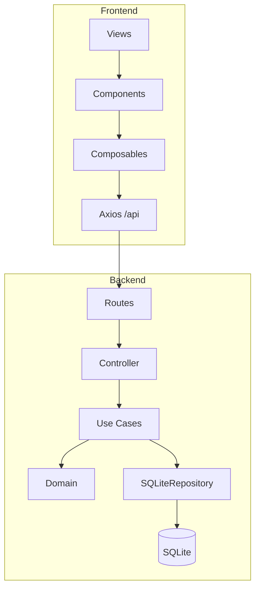

# Cadastro CPF

Sistema web de **cadastro e consulta de cidadãos brasileiros por CPF**, com validação de dígitos verificadores, persistência em SQLite e interface administrativa inspirada em sistemas municipais (identidade visual GESUAS).

## Tecnologias

| Camada | Tecnologias |
|--------|-------------|
| **Backend** | Node.js, Express 4, better-sqlite3, CORS |
| **Frontend** | Vue 3 (Composition API), Vuetify 3, Vue Router 4, Vite 6, Axios |
| **Testes** | Jest 29 + supertest (backend) |
| **Infraestrutura** | Docker, docker-compose |
| **Dev** | concurrently (sobe back + front juntos) |

## Estrutura do projeto

```
citizen-registry-system/
├── backend/
│   ├── src/
│   │   ├── domain/           # Entidades e regras de negócio puras
│   │   ├── application/      # Casos de uso
│   │   ├── infrastructure/   # SQLite, repositório concreto
│   │   └── http/             # Controllers, rotas, middlewares
│   ├── tests/                # Testes Jest
│   ├── data/                 # Banco SQLite (gerado em runtime)
│   ├── server.js
│   ├── Dockerfile
│   └── package.json
├── frontend/
│   ├── src/
│   │   ├── views/            # Páginas
│   │   ├── components/       # Componentes reutilizáveis
│   │   ├── composables/      # Lógica compartilhada
│   │   ├── services/         # Cliente HTTP (Axios)
│   │   ├── router/           # Rotas Vue
│   │   └── assets/styles/    # CSS global e design tokens
│   ├── vite.config.js
│   ├── Dockerfile
│   └── package.json
├── docker-compose.yml
├── package.json              # Scripts da raiz (dev, install:all, test)
└── README.md
```

## Como rodar

### Opção rápida (backend + frontend juntos)

Na raiz do projeto:

```bash
npm install
npm run install:all
npm run dev
```

- Backend: http://localhost:3000
- Frontend: http://localhost:5173
- Health check: `curl http://localhost:3000/health` → `{"status":"ok"}`

### Separado

```bash
# Terminal 1
cd backend && npm install && npm run dev

# Terminal 2
cd frontend && npm install && npm run dev
```

### Com Docker

```bash
docker-compose up
```

Acesse: http://localhost:5173

### Testes automatizados (backend)

Na raiz do projeto:

```bash
npm test
```

Ou dentro da pasta `backend`:

```bash
cd backend
npm install
npm test
```

**Com relatório de cobertura:**

```bash
cd backend
npm run test:coverage
```

**Rodar um arquivo ou suite específica:**

```bash
cd backend

# só integração HTTP (supertest)
npm test -- tests/http/citizens.routes.test.js

# só repositório SQLite em memória
npm test -- tests/SQLiteRepository.test.js

# só casos de uso
npm test -- tests/RegisterCitizen.test.js
npm test -- tests/UpdateCitizen.test.js
npm test -- tests/DeleteCitizen.test.js

# filtrar por nome do teste
npm test -- -t "cadastra cidadão"
```

Os testes **não precisam** do servidor rodando nem do banco em disco — usam SQLite `:memory:` e o app Express montado em memória.

### Build de produção (frontend)

```bash
cd frontend && npm run build
```

## Integração Frontend ↔ Backend

O frontend se comunica com o backend via proxy do Vite em desenvolvimento:

- Requisições vão para `/api/*` (ex: `/api/citizens`)
- O Vite redireciona para `http://localhost:3000/*`
- Configuração em `frontend/.env.development`

```
Frontend: GET /api/citizens?page=1&limit=10
    ↓ proxy (vite.config.js)
Backend:  GET http://localhost:3000/citizens?page=1&limit=10
```

### Teste manual

1. Cadastre um cidadão com CPF válido (ex: `529.982.247-25`)
2. Use a busca com o nome ou CPF cadastrado
3. Acesse **Lista de cidadãos** para ver a tabela paginada
4. Clique em **Baixar CSV** na home ou na lista para exportar os dados

## API

### Endpoints

| Método | Rota | Descrição |
|--------|------|-----------|
| `GET` | `/health` | Health check |
| `POST` | `/citizens` | Cadastrar cidadão |
| `GET` | `/citizens?query=` | Busca simples (sem paginação) |
| `GET` | `/citizens?page=&limit=&query=` | Lista paginada |
| `GET` | `/citizens/:id` | Visualizar por ID |
| `PUT` | `/citizens/:id` | Editar cidadão |
| `DELETE` | `/citizens/:id` | Remover cidadão (204) |
| `GET` | `/citizens/export?query=` | Exportar cidadãos em CSV |

### Listagem paginada

**Parâmetros:** `page` (padrão: 1), `limit` (padrão: 10, máx: 100), `query` (busca por nome ou CPF)

**Resposta:**

```json
{
  "data": [],
  "total": 42,
  "page": 1,
  "limit": 10,
  "totalPages": 5
}
```

A paginação é feita no backend com `LIMIT` + `OFFSET` — o frontend recebe apenas os registros da página atual.

### Exportação CSV

**Rota:** `GET /citizens/export?query=` (filtro opcional por nome ou CPF)

Retorna arquivo `text/csv` com colunas **Nome**, **CPF** e **Data de cadastro**. O frontend oferece download na home (atalho **Baixar CSV**) e na lista de cidadãos (respeitando o filtro de busca ativo).

### Erros da API

| Erro | HTTP | Mensagem |
|------|------|----------|
| `InvalidNameError` | 400 | Nome deve ter no mínimo 3 caracteres |
| `InvalidCpfError` | 400 | CPF inválido |
| `DuplicateCpfError` | 409 | CPF já cadastrado |
| `CitizenNotFoundError` | 404 | Cidadão não encontrado |

## Arquitetura

### Backend — Clean Architecture

O backend segue **arquitetura em camadas** com dependências apontando para dentro (domínio no centro):

```
HTTP (Controllers, Rotas, Middlewares)
        ↓
Application (Casos de uso)
        ↓
Domain (Entidades, Validadores, Interfaces)
        ↑
Infrastructure (SQLiteRepository — implementa a interface)
```

**Princípios aplicados:**

- Separação de responsabilidades por camada
- Repository Pattern: `CitizenRepository` é interface; `SQLiteRepository` é implementação
- Casos de uso isolados: cada operação é uma classe
- Domínio sem dependências externas (sem Express, sem SQLite)
- Injeção de dependência via `createCitizenController(repository)`
- Prepared statements contra SQL injection

#### Domain

| Arquivo | Descrição |
|---------|-----------|
| `Citizen.js` | Entidade com `id`, `name`, `cpf`, `createdAt` |
| `CpfValidator.js` | Sanitização e validação por dígitos verificadores da Receita Federal |
| `CitizenRepository.js` | Interface/contrato do repositório |

#### Application — Casos de uso

| Caso de uso | Arquivo | Descrição |
|-------------|---------|-----------|
| RegisterCitizen | `RegisterCitizen.js` | Cadastra cidadão; valida nome, CPF e duplicidade |
| FindCitizen | `FindCitizen.js` | Busca por nome ou CPF (até 10 resultados) |
| ListCitizens | `ListCitizens.js` | Lista paginada com filtro opcional |
| GetCitizen | `GetCitizen.js` | Busca cidadão por ID |
| UpdateCitizen | `UpdateCitizen.js` | Atualiza nome e CPF |
| DeleteCitizen | `DeleteCitizen.js` | Remove cidadão por ID |
| ExportCitizens | `ExportCitizens.js` | Exporta cidadãos para CSV |

#### Infrastructure

`SQLiteRepository.js`:

- Cria tabela `citizens` automaticamente
- Migração leve com `ensureColumn` para novas colunas
- Índices em `cpf` e `name`
- Paginação real no banco (`LIMIT` + `OFFSET` + `COUNT(*)`)
- Busca por nome (`LIKE`) ou CPF sanitizado

**Schema:**

```sql
CREATE TABLE citizens (
  id INTEGER PRIMARY KEY AUTOINCREMENT,
  name TEXT NOT NULL,
  cpf TEXT NOT NULL UNIQUE,
  created_at TEXT NOT NULL DEFAULT (datetime('now'))
);
```

#### HTTP

| Arquivo | Descrição |
|---------|-----------|
| `server.js` | Bootstrap Express, CORS, rotas, health check |
| `routes.js` | Definição das rotas REST |
| `citizenController.js` | Orquestra os casos de uso |
| `middlewares/cors.js` | CORS para o frontend |
| `middlewares/errorHandler.js` | Mapeia erros de aplicação para HTTP |

### Frontend

```
Views (páginas)
    ↓
Components (UI)
    ↓
Composables (lógica reutilizável)
    ↓
Services/api.js (Axios)
    ↓
Backend API (/api → proxy Vite)
```

**Padrões:** Composition API (`<script setup>`), composables, serviço centralizado de API, componentes com responsabilidade única, Vue Router com meta (título, menu ativo).

#### Rotas

| Rota | View | Descrição |
|------|------|-----------|
| `/` | `HomeView` | Página inicial com acesso rápido |
| `/cadastrar` | `RegisterView` | Formulário de cadastro |
| `/consultar` | `SearchView` | Busca por nome ou CPF |
| `/citizens` | `CitizenListView` | Lista de cidadãos com tabela paginada |
| `*` | `NotFoundView` | Página 404 customizada |

#### Telas

**Início** — boas-vindas e cards de acesso rápido.

**Cadastrar cidadão** — formulário com nome e CPF, máscara em tempo real, validação e feedback de erro.

**Consultar CPF** — busca por nome ou CPF, exibe card com dados do cidadão.

**Lista de cidadãos** — abas de navegação, busca com debounce (400ms), botões **Baixar CSV** e **+ Novo cidadão**, tabela com skeleton loader e paginação real no backend, diálogos de visualizar, editar e remover.

#### Componentes

| Componente | Função |
|------------|--------|
| `AppSidebar.vue` | Menu lateral fixo (verde degradê), navegação |
| `AppHeader.vue` | Título e subtítulo da página |
| `AppPageTabs.vue` | Abas horizontais na lista |
| `SidebarCityArt.vue` | Ilustração decorativa da prefeitura |
| `CitizenForm.vue` | Formulário de cadastro |
| `CitizenEditForm.vue` | Formulário de edição |
| `CpfSearch.vue` | Campo de busca com máscara |
| `CitizenCard.vue` | Card de exibição de um cidadão |
| `CitizenTable.vue` | Tabela com ações (visualizar, editar, remover) |
| `TablePagination.vue` | Paginação customizada |
| `QuickAccessGrid.vue` | Grid de atalhos na home (inclui **Baixar CSV**) |
| `GlobalSnackbar.vue` | Toast global de sucesso/erro |

**Ações da tabela:** ícones em botões quadrados com borda — olho e lápis em cinza (`#6B7280`), lixeira em vermelho (`#DC2626`).

#### Composables

**`useCpfMask.js`** — `unmask`, `mask`, `format`, `looksLikeCpf`, `isValid` (dígitos verificadores).

**`useCitizen.js`** — `loading`, `error`, `createCitizen`, `searchCitizen`, `listCitizens`, `getCitizen`, `updateCitizen`, `deleteCitizen`, `downloadCitizensCsv`, `normalizeCitizen` e mensagens de erro em português.

**`useSnackbar.js`** — feedback global reutilizável (`showSuccess`, `showError`).

**`useAppTheme.js`** — alternância de tema claro/escuro com persistência em `localStorage`.

#### Serviço de API (`services/api.js`)

Cliente Axios com `baseURL: /api`, timeout de 15s e interceptor de erros. Métodos: `create`, `search`, `list`, `getById`, `update`, `remove`, `exportCsv`.

## Experiência do usuário

| Recurso | Descrição |
|---------|-----------|
| **Dark mode** | Botão no header alterna tema claro/escuro (Vuetify + tokens CSS) |
| **Snackbar global** | Toasts de sucesso/erro centralizados em `GlobalSnackbar` |
| **Skeleton loader** | Tabela exibe skeleton enquanto carrega (sem spinner) |
| **Página 404** | Rota catch-all com `NotFoundView` |
| **Transição de rotas** | Fade suave entre páginas |
| **Favicon e título** | Ícone SVG personalizado e título dinâmico por rota |

## Identidade visual (GESUAS)

| Token | Valor | Uso |
|-------|-------|-----|
| `--color-primary` | `#2E5FA8` | Botões principais, links |
| `--color-secondary` | `#8DC63F` | Destaques verdes, paginação ativa |
| `--sidebar-gradient` | `#0B6A3E → #064C2D` | Sidebar |
| `--sidebar-active` | `#1A9455` | Item de menu ativo |
| `--color-error` | `#DC2626` | Ações de exclusão |

- Sidebar fixa: 260px, degradê verde escuro
- Cards com faixa verde lateral (`ui-card`)
- Tipografia: **Inter**
- Ícones: **Material Design Icons** (Vuetify)

## Testes

**Frameworks:** Jest 29 + supertest (backend)

### Como executar

| Comando | O que faz |
|---------|-----------|
| `npm test` (na raiz) | Roda todos os 45 testes do backend |
| `cd backend && npm test` | Mesmo resultado, a partir da pasta backend |
| `cd backend && npm run test:coverage` | Testes + relatório de cobertura em `backend/coverage/` |
| `npm test -- tests/http/citizens.routes.test.js` | Só testes de integração HTTP |
| `npm test -- tests/SQLiteRepository.test.js` | Só testes do repositório |
| `npm test -- -t "nome do teste"` | Filtra por descrição (`it(...)`) |

**Pré-requisito:** dependências instaladas (`npm install` na raiz + `npm run install:all`, ou `npm install` em `backend/`).

### Tipos de teste

| Tipo | Arquivo(s) | Estratégia |
|------|------------|------------|
| **Domínio** | `CpfValidator.test.js` | Validação de CPF isolada |
| **Casos de uso** | `RegisterCitizen`, `UpdateCitizen`, `DeleteCitizen` | Mocks do repositório |
| **Repositório** | `SQLiteRepository.test.js` | SQLite real em `:memory:` |
| **Integração HTTP** | `http/citizens.routes.test.js` | supertest + Express + SQLite `:memory:` |

### `tests/CpfValidator.test.js`

- Sanitização de CPF formatado
- Aceita CPF válido (com e sem máscara)
- Rejeita dígitos verificadores incorretos
- Rejeita todos os dígitos iguais
- Rejeita tamanho incorreto

### `tests/RegisterCitizen.test.js`

- Cadastra cidadão com dados válidos
- Rejeita nome com menos de 3 caracteres
- Rejeita CPF inválido
- Rejeita CPF duplicado

### `tests/UpdateCitizen.test.js`

- Atualiza cidadão com dados válidos
- Rejeita cidadão inexistente, nome inválido e CPF inválido
- Rejeita CPF duplicado de outro cidadão
- Permite manter o mesmo CPF do próprio registro

### `tests/DeleteCitizen.test.js`

- Remove cidadão existente
- Rejeita cidadão inexistente

### `tests/SQLiteRepository.test.js`

- Banco em memória (`:memory:`) — sem dependência de arquivo em disco
- `create`, `findById`, `findByCpf`, `findByQuery`
- `findAll` com paginação e filtro
- `findAllForExport`, `update`, `delete`

### `tests/http/citizens.routes.test.js`

- Integração HTTP com **supertest** e app Express real
- `GET /health`, `POST /citizens`, `GET /citizens`, `GET /citizens/:id`
- `PUT /citizens/:id`, `DELETE /citizens/:id`, `GET /citizens/export`
- Valida status HTTP e corpo das respostas de ponta a ponta

**Total: 45 testes.** Casos de uso isolados usam mocks; repositório e rotas usam SQLite em memória.

### Teste manual da API (com servidor rodando)

Com o backend no ar (`npm run dev` na raiz ou `cd backend && npm run dev`):

```bash
# Health check
curl http://localhost:3000/health

# Cadastrar cidadão (CPF válido de exemplo)
curl -X POST http://localhost:3000/citizens \
  -H "Content-Type: application/json" \
  -d '{"name":"Maria Silva","cpf":"529.982.247-25"}'

# Listar com paginação
curl "http://localhost:3000/citizens?page=1&limit=10"

# Busca simples por nome
curl "http://localhost:3000/citizens?query=Maria"

# Buscar por ID (substitua 1 pelo id retornado no cadastro)
curl http://localhost:3000/citizens/1

# Atualizar
curl -X PUT http://localhost:3000/citizens/1 \
  -H "Content-Type: application/json" \
  -d '{"name":"Maria Santos","cpf":"529.982.247-25"}'

# Remover
curl -X DELETE http://localhost:3000/citizens/1

# Exportar CSV
curl -O -J "http://localhost:3000/citizens/export"
```

**Erros esperados (úteis para validar):**

```bash
# 400 — nome curto
curl -X POST http://localhost:3000/citizens \
  -H "Content-Type: application/json" \
  -d '{"name":"Ab","cpf":"529.982.247-25"}'

# 400 — CPF inválido
curl -X POST http://localhost:3000/citizens \
  -H "Content-Type: application/json" \
  -d '{"name":"Maria Silva","cpf":"111.111.111-11"}'

# 404 — ID inexistente
curl http://localhost:3000/citizens/999
```

## Decisões técnicas

| Decisão | Motivo |
|---------|--------|
| SQLite | Zero configuração, ideal para MVP |
| Clean Architecture | Testabilidade e troca de banco sem afetar regras de negócio |
| Repository Pattern | Desacopla persistência dos casos de uso |
| CpfValidator isolado | Regra crítica testada independentemente |
| Prepared statements | Segurança contra SQL injection |
| Paginação no backend | Escalabilidade; frontend não carrega todos os registros |
| Composables Vue | Lógica reutilizável sem poluir templates |
| Proxy Vite em dev | Evita problemas de CORS |
| Vuetify 3 | Componentes prontos + Material Design Icons |

## Fluxo da aplicação



## O que eu adicionaria com mais tempo

- Autenticação JWT e controle de acesso por perfil
- Testes E2E com Playwright
- Testes unitários no frontend (Vitest)
- CI/CD com GitHub Actions
- Paginação por cursor para grandes volumes
- Swagger/OpenAPI para documentação da API
